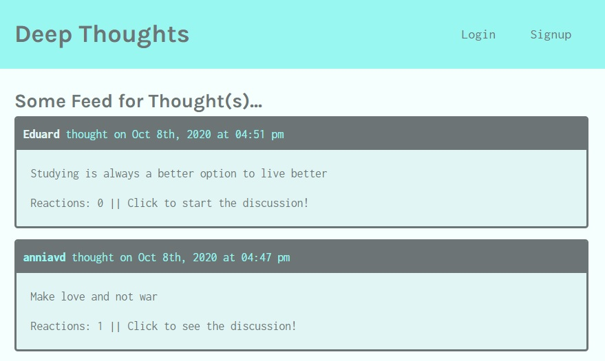
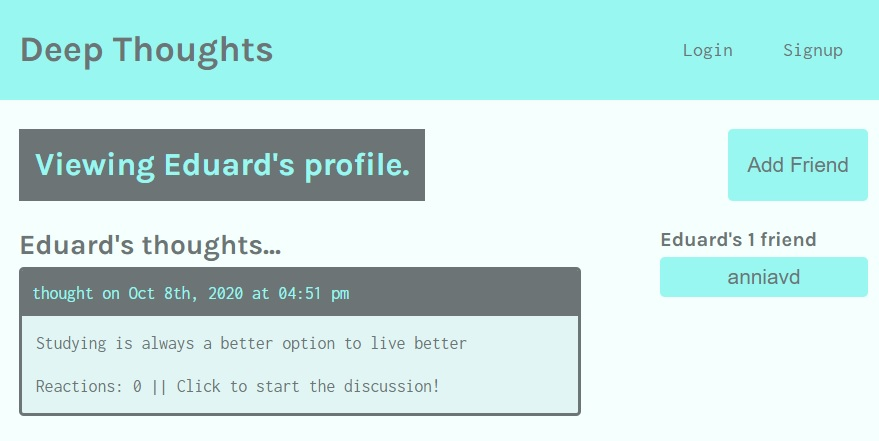
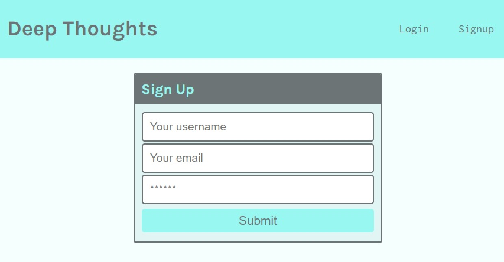
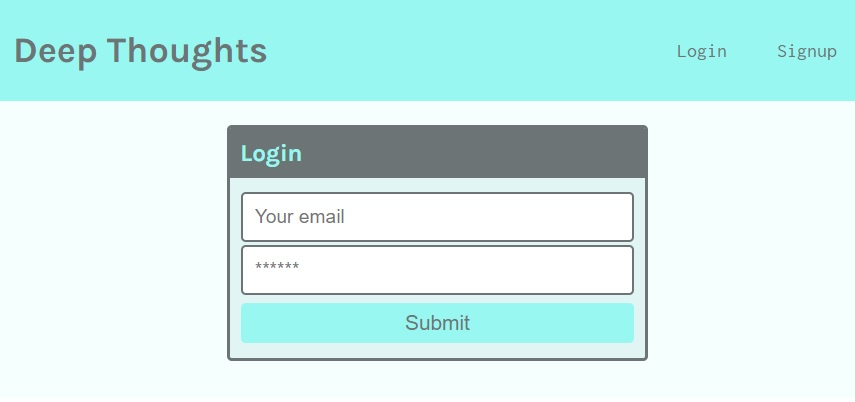
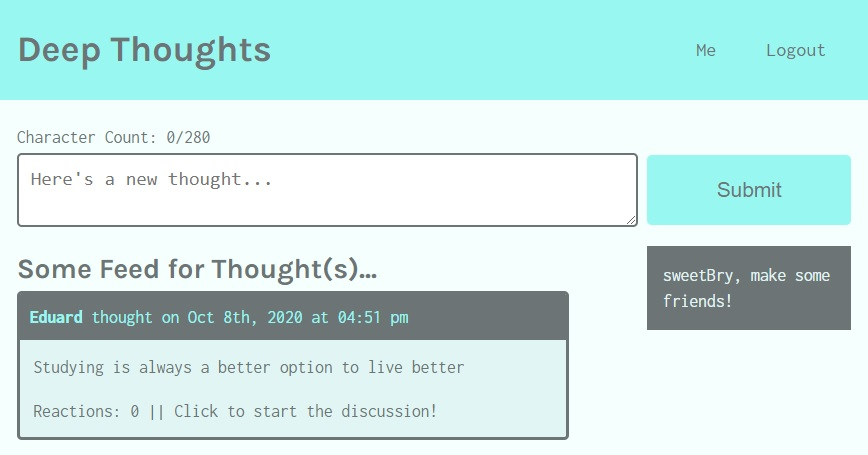
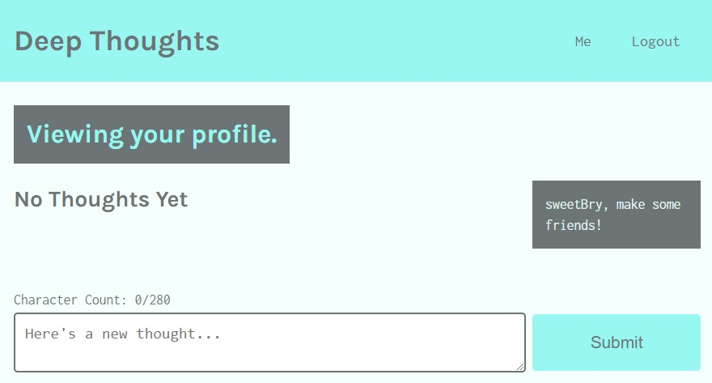
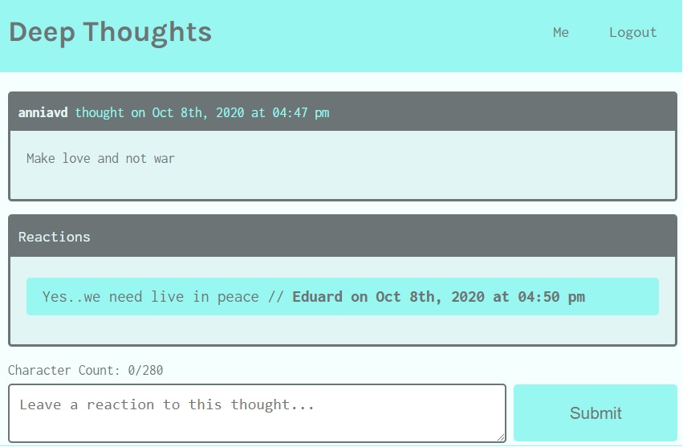

# DEEP THOUGHTS

  
# Description

Deep Thoughts is a social media application to share thoughts and reactions about them, where each user can have their account and add friends.

 

### Visit the site! [Deep Thoughts](https://deepsthought.herokuapp.com/)

# Table of Contents

[Installation](#Installation)

[Usage](#Usage)

[License](#License)

[Technologies](#Technologies)

[Questions](#Questions)

# Installation
 - Clone the app in to your pc.
 - In the client and server folder run on console terminal  `npm install`.
- In the project directory run: `npm install` and then `npm start`.

# Usage
- The user will be able to see the deep thoughts posted when visiting the site.

- The user can see the profile of another user by clicking on `the name of the user` or can see the information of the thought by clicking on another part of the thought box.

- The user can `Signup` and `Login`  by clicking on these options that appear in the menu of the site as shown in the following images:

> - Signup form.

 

> - Login form.

 

- The user once logged in can add a thought to publish as shown below.

 

- Once logged  the user is shown a way to write a thought and the associated friendships he or she has or else shows him a message inviting him to make friends  clicking on menu `Me`.

 

- Once logged in, the user can add a reaction to a selected thought by clicking on the reaction text.

 

- The user can exit their section by clicking on the menu `Logout`.

# License
The license for which the application is covered:NONE 

# Technologies 
- React
- Javascript
- MongoDB
- Mongoose
- Qraphql
- Test
- Bcrypt
- Express
- JWT
- Moment
- Heroku

# Questions

  If you have questions about the project, below you can find ways to answer them, either by visiting my highub or contacting me by email
  
  Link to my Github: [anniavd](https://github.com/anniavd)

  
  Email acount: [annia.valdesd@gmail.com](mailto:annia.valdesd@gmail.com)